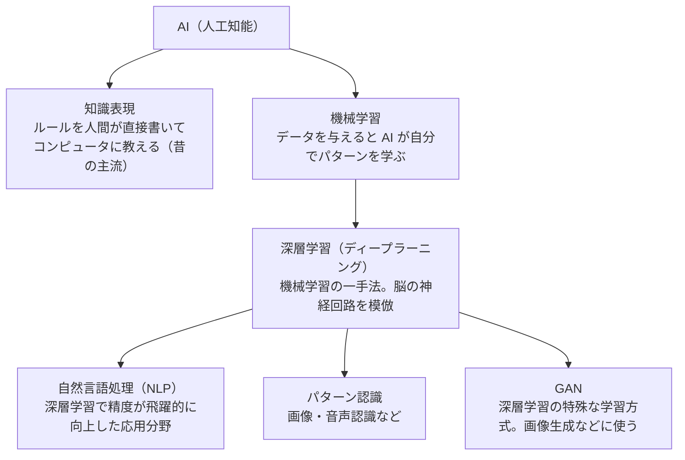
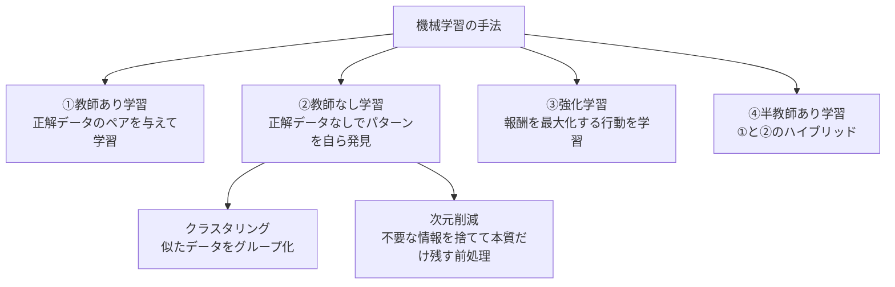
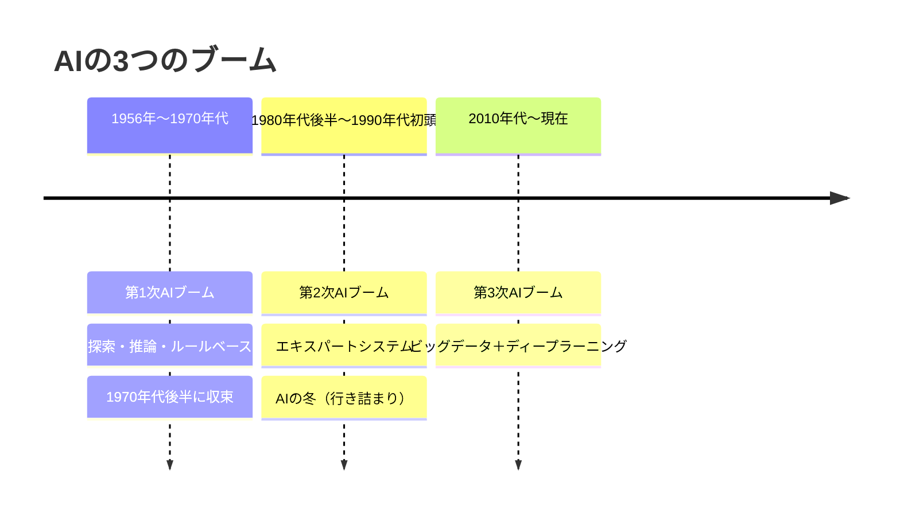

# 第1章：AIの基礎知識・仕組み・種類・歴史

***

# 第1章：AI の基礎知識

***

## 1. AI という用語の始まり

* **1956年 ダートマス会議**で初めて「AI（人工知能）」という用語が使用された

***

## 2. AI 研究が始まった背景

* **第二次世界大戦** と **計算機の発展** がきっかけ

  * 敵の暗号解析・軍事計算のためにコンピュータ開発が加速

  * 戦時中の技術ニーズ → コンピュータ産業全体の発展に大きく影響

* 戦後、「プログラム通りに動くだけ」のコンピュータをさらに進化させ、**人間のように判断できる機械を作る**ことが AI 研究の目的となった

***

## 3. AI の活用分野

### 現在の主な活用分野

| 分野              | 概要                                                          |
| --------------- | ----------------------------------------------------------- |
| 機械学習            | **データからパターンを学習する技術**                                        |
| 深層学習（ディープラーニング） | 人間の脳の仕組みを模した多層ニューラルネット                                      |
| 自然言語処理（NLP）     | 文章・言語の理解・生成                                                 |
| 知識表現            | 人間の知識（ルール・関係性）をコンピュータが推論できる形式（if-then ルール、知識グラフ等）に変換・格納する技術 |
| パターン認識          | 画像・音声などのパターンを識別する                                           |

### 技術用語の包含関係



### 将来期待される活用分野

* 自動運転、音声認識、画像認識、医療診断、金融予測　など

***

## 4. ディープラーニング（深層学習）

* AI の機能の一部であり、**人間の脳の情報処理の仕組みを模したもの**

* 「小さな考える部品（ニューロン）」を多層に積み重ねた特別なプログラム

* 写真・文章などから **パターンを自ら見つけ出して学習** する

* ディープラーニングの進化により **画像認識・自然言語処理の精度が大幅に向上**

### ディープラーニングの成果物 = 「学習済みモデル」

* ディープラーニングは **学習の手法**、その結果できあがるのが **学習済みモデル（成果物）**

* 対象データの種類によって様々な学習済みモデルが生まれる：

| 学習済みモデルの種類        | 扱うデータ    | 具体例               |
| ----------------- | -------- | ----------------- |
| **LLM（大規模言語モデル）** | テキスト（言語） | ChatGPT、Gemini など |
| 画像認識モデル           | 画像       | 猫/犬の判定など          |
| 音声認識モデル           | 音声       | Siri、音声文字起こし      |
| 生成モデル             | 画像・音楽・映像 | Midjourney など     |

* **LLM はディープラーニングによって作られた「学習済みモデル」の一種**（言語専門）であり、成果物＝LLM だけではない点に注意

### GAN（Generative Adversarial Network）

* ニューラルネットワークを用いた機械学習の手法

* **画像・音楽・映像の自動生成**など、AI の新しい用途を生み出した

***

## 5. AI の普及に伴う問題点

### ① 仕事の喪失問題

* 自動化技術の発展により、**単純作業・ルーチンワーク**が代替されるリスク

* 対策として「**職業訓練の拡充**」「**新しい雇用機会の創出**」が重要課題

### ② プライバシー・倫理問題

* AI が個人データを処理する際に **プライバシー侵害のリスク**

* 医療・法律など倫理的判断が求められる分野では **AI の決定責任** が問われる

* 以下の点について社会全体での議論・規制が必要：

  * アルゴリズムの透明性（どのように決定しているか）

  * **偏り（バイアス）・差別的な要素** がないか

  * 人間の介入がどの程度必要か

***

# 第2章：AIに知能をもたらす仕組み

***

## 1. AIに知能をもたらす二つの仕組み

| 手法         | 内容                                           | 特徴                                       |
| ---------- | -------------------------------------------- | ---------------------------------------- |
| **ルールベース** | 人間が事前に作成したルール・知識をプログラムに組み込み、それに基づいて予測・判断する技術 | 複雑な問題には大量のルールが必要で管理が困難                   |
| **機械学習**   | 機械自身がデータからパターンを見いだし、予測・判断を行う技術               | 統計的手法・アルゴリズムを用いて大量データから機械が自ら学習。**現在の主流** |

***

## 2. 機械学習の4つの手法



| 手法           | 一言まとめ                                             |
| ------------ | ------------------------------------------------- |
| **①教師あり学習**  | 入力データに**正解データのペア**を与えてモデルを学習させる手法。分類・回帰などに対応      |
| **②教師なし学習**  | 正解データを与えず、**データ自体のパターン・構造をモデルが自ら発見**して学習する手法      |
| **③強化学習**    | コンピュータに\*\*報酬（目標達成の対価）\*\*を設定し、目標達成に最適な行動を学習させる手法 |
| **④半教師あり学習** | 少量の正解データ＋大量のラベルなしデータで効率的に学習する①と②のハイブリッド手法         |

***

## 3. 教師あり学習

**イメージ：** 子供が動物の絵本を読むとき、親が「これはライオンだよ」と教えると、次にその動物を見たとき「これはライオン」と言えるようになる。

* 入力データと**正解データのペア**を繰り返し学習することで、未知のデータに対しても正しいラベルを予測できる

* **分類・回帰**など様々な問題に対応可能

***

## 4. 教師なし学習

**イメージ：** おもちゃ箱の中に様々な形・色のブロックがあるとき、誰も教えてくれなくても自分で観察して同じ色・形ごとにグループ分けできる。

* 正解データがなくても、**データ自体のパターンや構造を自ら発見**することで学習する

### クラスタリング

* 教師なし学習の手法の一つ

* 与えられたデータを**似た特徴・パターンを持つグループ（クラスター）に分類**する

* データの類似性・パターンを見つけることで、**データの分類・分析・整理**に役立つ

### 次元削減

**「次元」とは？**
データが持つ情報の軸（項目）の数のこと。
例：人のデータなら「身長・体重・年齢・住所・年収・趣味…」と項目が多いほど次元が高い。

**何のために削減するか？**
AIに大量の項目を全部学習させると、計算量が爆発して学習が遅くなったり精度が落ちる。
→ **本質的な特徴だけ残して不要な項目を捨てる前処理**が次元削減。削減した後の軽いデータでAIが学習する。

**イメージ：**
地域全体の詳細な地図（全情報）→ 自宅から学校までの主要な道だけの簡易地図（必要な情報だけ）
地図を小さくした後、その地図を見て「どのルートが最短か」を考える＝AIが学習する

**効果：** 計算コストの削減 ／ モデルの性能向上 ／ データの可視化が容易になる

***

## 5. 強化学習

**イメージ：** ゲームで「コイン取得 +10pt、モンスターに当たる -5pt」というルールの中で、最初は試行錯誤するが、繰り返すうちに高ポイントを得る行動を学んでいく。

* **試行錯誤を繰り返して良い結果をもたらす行動を学ぶ**手法

* コンピュータに**目標**が設定され、達成のために**報酬**が与えられる

* 初めはランダムに行動 → 徐々に**報酬を最大化する行動**を見つけ出す

* 応用例：**ゲームAI開発、自動運転車**など

***

## 6. 半教師あり学習

**まず「ラベル」とは？**
データに付ける**正解の名前タグ**のこと。
例：犬の写真1万枚に「犬」と書いたタグを人間が手作業で付ける → これが「ラベル付け」。
ラベルが付いたデータ＝**ラベルあり**、付いていないデータ＝**ラベルなし**。

**半教師あり学習のイメージ：**

* 犬の写真1万枚のうち、100枚だけ人間が「犬」とラベルを付ける（コスト小）

* 残り9,900枚はラベルなしのまま投入

* AIが「この100枚と似た特徴を持つ写真は全部犬だろう」と自分で推測しながら学習する
  → 少ないラベルで大量のデータを効率的に学習できる

|     | 内容                                                               |
| --------- | ---------------------------------------------------------------- |
| **メリット**  | ラベル付け作業が少なくて済む → **学習コストを大幅に削減**できる                              |
| **デメリット** | ラベルの付け方に**偏りが生じる**ことがある／AIが推測したラベルが間違う可能性がある／教師あり学習に比べて**精度が低い** |

***

## 7. ノーフリーランチ定理

**「ノーフリーランチ」は人の名前ではなく慣用句**
英語で「No Free Lunch＝タダ飯はない」→「都合よく万能なものはない」という意味。

* **どの問題にも万能で汎用的なAIモデルは存在しない**という定理

* 画像認識が得意なモデルが言語翻訳も得意とは限らない

* → 問題ごとに**最適な手法を選んで使い分けること**が重要

***

## 8. 人工ニューロン・ニューラルネットワーク・重み付け

**これは「AIが学習する仕組みを脳の構造で説明したもの」。順番に読むと理解できる。**

### ① ニューロンとは（人間の脳の話）

* 脳は無数の\*\*神経細胞（ニューロン）\*\*がつながってできている

* ニューロン同士の接続部を**シナプス**という

* 同じ情報が何度も伝わると → シナプスが太くなる → 情報が伝わりやすくなる

* これが「**慣れ・記憶・学習**」の正体

### ② 人工ニューロン・ニューラルネットワーク（AIへの応用）

* 人間のニューロンの仕組みをプログラムで再現したものを**人工ニューロン**という

* 人工ニューロンをたくさんつなげた構造を**ニューラルネットワーク**という

* それをさらに**何層にも重ねた**ものを**ディープニューラルネットワーク**という

* このDNNを使った学習手法が**ディープラーニング（深層学習）**

```
ニューロン（人間の神経細胞）
    ↓ プログラムで再現
人工ニューロン
    ↓ たくさんつなげる
ニューラルネットワーク
    ↓ 何層にも重ねる
ディープニューラルネットワーク（DNN）
    ↓ これを使った学習手法
ディープラーニング（深層学習）
```

### ③ 重みと重み付け（「学習」の正体）

* シナプスの太さ（伝わりやすさ）をAIで表したものが**重み**

* 大量データを繰り返し学習するたびに「この入力とこの正解には強い関係がある」と判断された経路の重みが大きくなる

* この「どの情報を重視するか・しないかを数値で調整する操作」が**重み付け**

* **重み付けの更新を繰り返すこと＝AIの学習**

### ③-補足 DNNが学習するプロセス（順伝播と逆伝播）

DNNはデータを1回流すだけでは学習できない。「予測 → 答え合わせ → 修正」を大量に繰り返すことで重みを最適化していく。

```
①順伝播（フォワードパス）
   入力データをネットワークに流す
   各層の人工ニューロンが現在の重みで計算し、最終的に予測結果を出力

        ↓

②誤差の計算（ロス）
   予測結果と正解データを比較し、「どれくらいズレているか（誤差）」を計算

        ↓

③逆伝播（バックプロパゲーション）
   誤差を出力層から入力層へ逆向きに伝え
   「どの重みが誤差の原因か」を特定し、重みを修正する

        ↓

④①〜③を大量データで繰り返す
   繰り返すたびに重みが最適化され、予測精度が上がっていく
   ＝ AIが「学習した」状態
```

**ポイント：** 一度流すだけでなく、**誤差を逆向きに伝えて重みを修正する（逆伝播）** という仕組みがDNN学習の核心。

### ④ 画像認識の例（ディープラーニングの実際の動き）

1. 画像を細かい**画素**に分解
2. 画素の位置・色を**数字データ**として抽出
3. 層を重ねながら「**エッジ→形→顔のパーツ→顔全体**」と徐々に複雑な特徴を抽出
4. 最終的に「これは猫」と認識

→ **「単純な特徴を積み上げて複雑な認識へ」という流れが人間の認知と似ている**

***

## 9. 過学習（オーバーフィッティング）

* 機械学習モデルが**訓練データに過度に適応してしまう**現象

* 訓練データ特有の**ランダムなノイズまで覚え込んでしまう**ことが原因

* 訓練データでは高精度だが、**未知のデータに対して予測精度が著しく低下**する

**イメージ：** テスト問題を丸暗記して満点を取ったが、少し違う問題が出たら全く解けない状態

### 過学習の回避方法

| 方法             | 内容                                                      |
| -------------- | ------------------------------------------------------- |
| **アーリーストッピング** | データの一部を検証用として確保し、学習途中で定期的に性能をチェックして**最適なタイミングで学習を止める**  |
| **正則化**        | ※下記参照                                                   |
| **ドロップアウト**    | 学習時にランダムに一部の人工ニューロンを無効化し、**特定の情報への依存を防ぐ**。より汎用性の高いAIになる |

### 正則化とは

**「正則化」という言葉の意味：**
「正則」＝数学用語で「きちんと整った・適正な」という意味。
「正則化」＝**モデルを"適正な複雑さ"に整える処理**のこと。

**なぜ必要か？**
AIモデルは学習する「パラメータ（調整するつまみ）」が多ければ多いほど、細かい情報まで覚えようとする。
つまみが多すぎる = 訓練データのノイズまで覚えてしまう = **過学習**。

**正則化でやること：**
「このつまみはあまり大きく動かすな」というペナルティをモデルに課すことで、
モデルが必要以上に複雑にならないよう**調整・制限**する。

→ 結果として「細かいノイズは無視して、本質的なパターンだけ学ぶ」モデルになる

***

## 10. 転移学習

* AIが**一つのタスクで学んだ知識を、別のタスクへ活用する**学習手法

* **例：** 動物の画像識別を習得したAIが、その経験（視覚的特徴・分類の原則）を活かして植物の画像分類にも取り組む

* ゼロから学ぶよりも**迅速にスキルを獲得**できる

* 人間が関連知識を新しい状況に適用することに類似 → **学習の効率化**を実現する重要な手法

***

# 第3章：AIの種類・歴史・シンギュラリティ

***

## 1. AIのレベル別分類（レベル1〜4）

AIは処理できる内容に応じて4つのレベルに分類される。

> **💡 レベルと手法の関係：**
> 機械学習・ディープラーニングは「AIモデルを作るための製造方法」。
> その製造方法の違いが、そのままAIが何をできるかの能力レベルを決める。
> → **製造方法（手法） = AIの能力レベル** という関係。

| レベル      | 種類               | 内容                                                                         | 代表例                                     |
| -------- | ---------------- | -------------------------------------------------------------------------- | --------------------------------------- |
| **Lv.1** | 単純な制御プログラム       | 条件分岐に従い、入力に対してあらかじめ決められた出力を行うだけ。**学習なし・自律性なし**（実質はプログラムに近いが、AIの分類に含める） | AI家電（冷蔵庫・エアコンなど）                        |
| **Lv.2** | ルールベースシステム       | 入力データを解析して単純な予測・決定を行う。**あらかじめ用意したルール表で応答するだけ**（LLMは使わない・学習なし）              | チャットボット・音声認識の質疑応答システム                   |
| **Lv.3** | 機械学習を利用したAI      | 入力から自らデータのパターンを見出し、最適な出力を調整して返す                                            | 検索エンジン                                  |
| **Lv.4** | ディープラーニングを利用したAI | **特徴量**（データを特定する要素）の調整を含めた学習が自ら可能                                          | 自動車の自動運転技術・**ChatGPTなどのLLMを使ったチャットボット** |

> **⚠️ Lv.2とLv.4のチャットボットの違い：**
>
> * Lv.2：ルール表に「おはよう→おはようございます」と書いてあるだけ。ルール外の質問には答えられない
>
> * Lv.4（ChatGPT等）：ディープラーニングで学習したLLMが文脈を理解して柔軟に応答する

***

## 2. ANIとAGI

| 概念      | 正式名称                                  | 内容                                                     |
| ------- | ------------------------------------- | ------------------------------------------------------ |
| **ANI** | Artificial Narrow Intelligence（特化型AI） | AIが**特定のタスク**に対して人間並みの性能を発揮する。**一つの分野のプロ**だが、それ以外はできない |
| **AGI** | Artificial General Intelligence（汎用AI） | AIが**すべての知的タスク**に対して人間並みの性能を発揮する                       |

### ANIのイメージ

* チェスをプレイするAI → チェスは強いが別のゲームは無理

* 音声認識システム → 音声をテキスト化はできるが画像分析はできない

* 一つのタスクには非常に優れているが、**他の分野には対応できない**

### AGIのイメージ

* 学習・理解・推論・計画など**人間の知能が持つ多様な能力**をすべて持つ

* 新しい環境や状況にも**柔軟に適応**し、様々な問題に対処できる

* ⚠️ **現時点ではAGIは存在しない**。実現には多くの技術的課題が残されている

* もし実現すれば → 人間が行う**あらゆる知的タスク**をAIが実行可能になる

***

## 3. AIの歴史：3つのブーム



| ブーム     | 時期                   | 内容                                            | 終焉の理由                                               |
| ------- | -------------------- | --------------------------------------------- | --------------------------------------------------- |
| **第1次** | 1956年〜1970年代後半（約20年） | **探索と推論**に焦点。ルールベースのシステムが主流。自然言語処理・機械学習の分野も発展 | ルールベースのシステムが複雑な問題に**不適切**であることが判明                   |
| **第2次** | 1980年代後半〜1990年代初頭    | **エキスパートシステム**（専門家の意思決定を模倣するシステム）が注目を集めた      | 専門家の知識を正確に取り込むことが困難・知識ベースが大きくなりすぎて管理困難 → **「AIの冬」** |
| **第3次** | 2010年代〜現在            | **ビッグデータの活用**と**ディープラーニング技術の発展**が特徴           | （継続中）                                               |

***

## 4. シンギュラリティ（技術的特異点）

* AIが人間を超越し、**知能的に自己進化する状態**

* 最初に**バーナー・ビンジ**（数学者）が提唱

* その後**レイ・カーツワイル**（AI研究の権威・未来学者）が著書で言及し広く話題になった

### 2045年問題

* レイ・カーツワイルが提起した問題

* 「AIやバイオテクノロジーが進化した結果、**2045年頃にシンギュラリティが起こり**、AIが人間の知性を超越する」というもの

* シンギュラリティが起こると…

  * 医療・介護・交通・物流・工業生産などで**自動化が急速に進む**

  * バイオテクノロジーにより**人間自身がアップグレードされる**可能性

  * 人間の労働・生活・人間としての意義や目的など**あらゆる面で大きな変化**を迎える

***

## 5. AI効果

* AI技術が進歩して**日常的に使われるようになると、「もはやAIではない」と感じられる現象**

* 新しいAI技術が一般に受け入れられ日常に馴染むと、**「特別な技術」という認識が薄れる**ことが原因

* 結果として、AIの進化は**目に見えない形で進行する**ことになる

> **例：** カーナビ・迷惑メールフィルタ・顔認証など、登場当初はAIと話題になったが今は「当たり前」と感じられている
